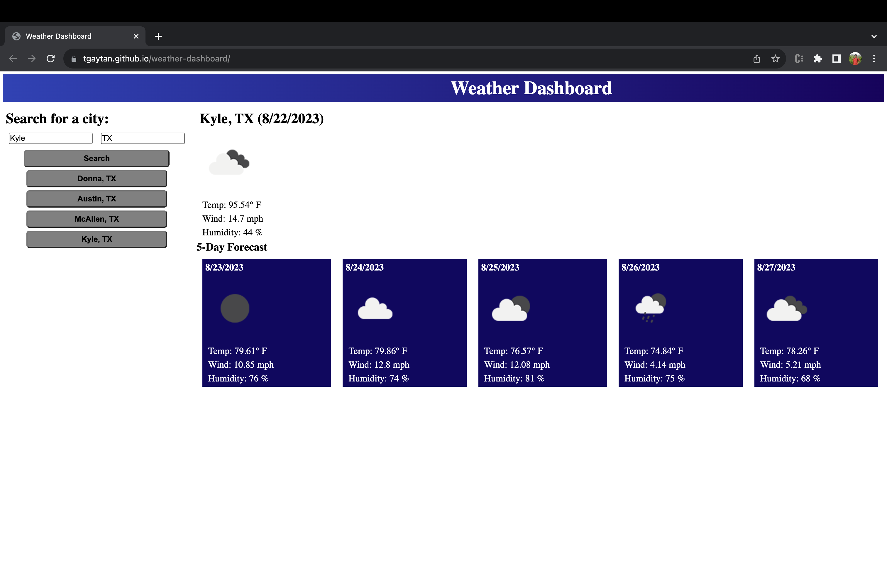

# Weather Dashboard
A dashboard that shows the weather for the city you search

## Description

This application will give you the 5-day forecast for a city located in the Unites States.  It takes the city name provided and uses the OpenWeather API to get the weather for the next 5 days.  I created this page to practice making API calls with javascript and then using javascript to display that information to the web page.

## Installation

N/A

## Usage

Navigate to the application at this URL: https://tgaytan.github.io/weather-dashboard/

To get the 5-day forecast, type a city and state name in the search bar.  The first bar is for the city name and the second bar is for the state name.  The state name should be provided in a 2-letter format. For example "Texas" would require an input of "TX".

Once you search, the weather will be displayed for today and for the next 5 days.  Old searches will be shown under the search button and you can click on them to check the forecast for that city again.  Here is a screenshot of the page

## Credits

N/A

## License

N/A